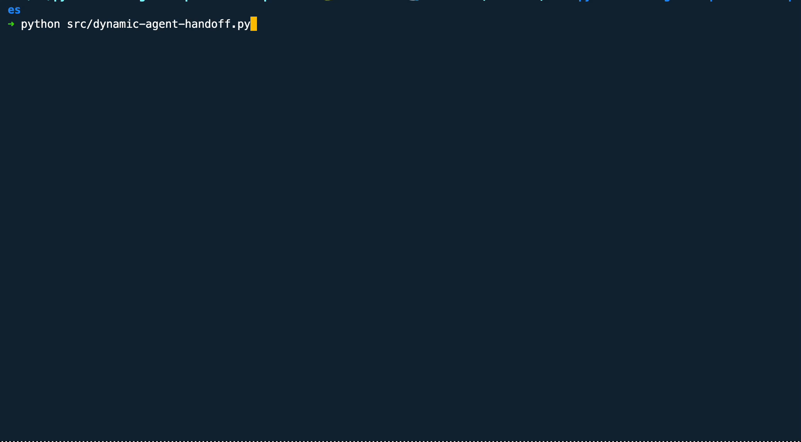
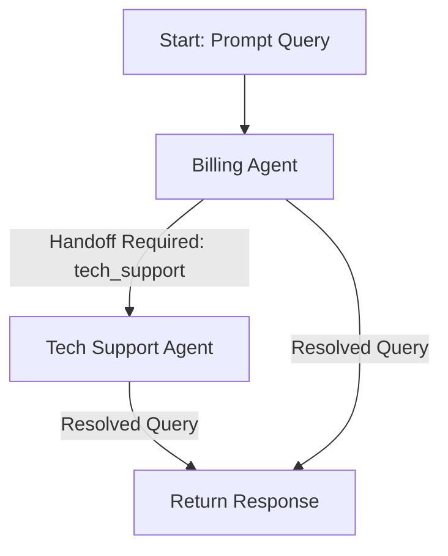

# Programmatic Agent Handoff with PydanticAI

The Programmatic Agent Handoff pattern allows application code to dynamically manage transitions between agents, providing flexibility and clarity in multi-agent workflows.

In this example, we'll explore how customer queries can be routed between a **Billing Agent** and a **Tech Support** Agent, depending on the nature of the query. The implementation also supports an interactive session where users can ask multiple questions in a single run.

The following post will look at router-based agent handoff for a more structured approach.

## Example Code: Dynamic Agent Handoff

You can find the complete implementation in the file: [dynamic_agent_handoff](./agent_handoff.py).

## How It Works

The control flow follows the **Programmatic Agent Handoff** pattern, where the application code determines transitions between agents dynamically in a continuous, interactive session.



### 1. Prompt the User Query

The application starts by sending the user query to the **Billing Agent**. This agent evaluates whether it can resolve the query or needs to pass it to another agent.

Examples:

- **Billing Query**: For a query like "Why is my bill so high?", the Billing Agent resolves it directly.
- **Technical Query**: For a query like "My monitor screen is not turning on.", the Billing Agent hands it off to the Tech Support Agent.

### 2. Process the Query

Each agent processes the query and determines its next steps:

- If the query falls outside its scope, the agent sets the next_agent field to specify the next agent.
- If the query is resolved, the agent provides the final response.

### 3. Handoff to Another Agent

The application routes the query to the specified agent if the next_agent field is set (e.g., "tech_support"). The system also logs handoffs, such as:

```plaintext
Handing off to Tech Support...
```

This logging improves system transparency and helps users understand the flow.

### 4. Return the Final Response

Once an agent resolves the query, the loop terminates, and the final response is returned to the user. The user can then ask another query or exit the session by typing quit or exit.

## Example Flow

This workflow can be summarised as:



## Input/Output Examples

### Input Prompt

```plaintext
"Why isn't my monitor turning on?"
```

### Output

```plaintext
Handing off to Tech Support...

Support Response: To troubleshoot the issue with your monitor not turning on, please try the following steps:

1) Check the power cord and ensure it's properly connected to both the monitor and the power source.

2) Check if the monitor is turned on using the correct button.

3) If the monitor has multiple input sources, ensure you're using the correct input.

4) Try connecting the monitor to a different power source.

5) If none of the above steps work, it's possible that there's a hardware issue with the monitor. If you're still under warranty, you may want to contact the manufacturer for further assistance. If you're experiencing any other technical issues, feel free to ask.
```

## Evaluating Programmatic Agent Handoff

### Advantages

- **Flexibility**: The application dynamically determines agent transitions, adapting to various query types
- **Scalability**: Additional agents can be added easily to handle more specialised queries
- **Reusability**: Stateless agents can be reused across multiple workflows
- **Transparency**: Handoff logging helps users understand the system's decision-making

### Limitations

- **Increased Complexity**: Application code must manage agent transitions, which can grow complex as workflows expand
- **Latency**: Multiple handoffs may increase response times

## Conclusion

This example demonstrates how Programmatic Agent Handoff enables flexible, scalable workflows in PydanticAI.

This approach allows for clear and dynamic agent interactions by delegating control to application code, making it ideal for scenarios with well-defined query types and transitions.
