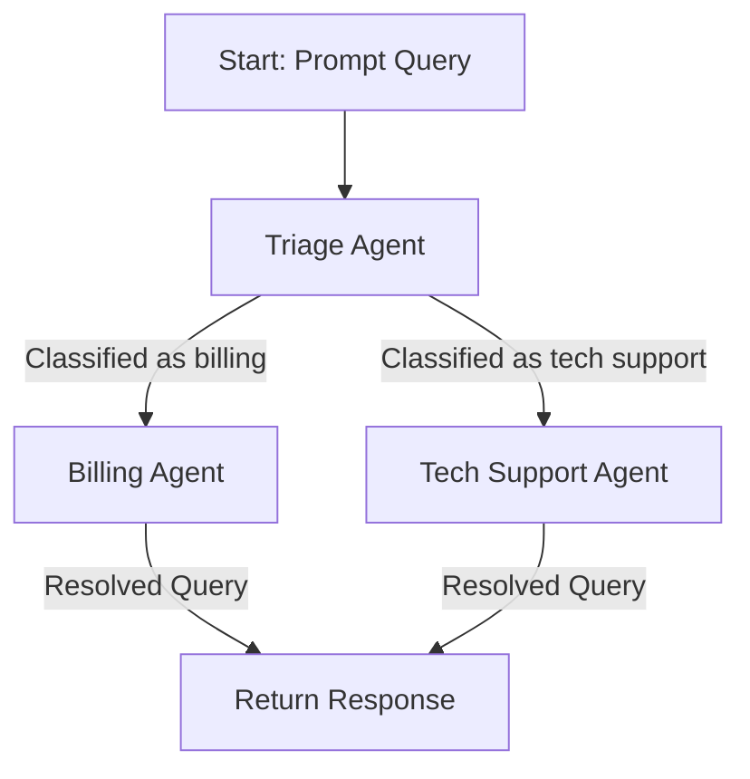

# Router-Based Agent Handoff with PydanticAI

The **Router-Based Agent Handoff** pattern provides a structured approach to managing multi-agent workflows by using a **triage agent** to classify user queries and route them to the appropriate specialised agent.

This method simplifies transitions and ensures the right agent handles each query type, enabling scalability and clarity.

In this example, we'll explore how customer queries can be classified and routed between a **Billing Agent** and a **Tech Support Agent** using a **Triage Agent**.

## Example Code: Router-Based Handoff

The full implementation of this example can be found in the file: [router_handoff](./router_handoff.py).

## How It Works

In the **Router-Based Handoff** pattern, a **Triage Agent** acts as the decision-maker, classifying user queries and routing them to the appropriate agent. Unlike the **Programmatic Agent Handoff** pattern, where the application code directly manages transitions, this pattern delegates classification logic to the triage agent, improving modularity.


### 1. Triage the Query

The **Triage Agent** evaluates the user query to determine its category and sets the `target_agent` field accordingly:

- **Billing Query**: The query is routed to the **Billing Agent** for resolution.

- **Technical Query**: The query is routed to the **Tech Support Agent**.

#### Examples

- For a query like _"Why is my bill so high?"_, the triage agent routes it to the billing agent.

- For a query like _"My monitor screen is not turning on."_, the triage agent routes it to the tech support agent.

### 2. Route to the Target Agent

The **Agent Router** handles the routing based on the `target_agent` field set by the triage agent. The router ensures the appropriate agent processes the query.

#### Example Log

```plaintext
Handing over to billing
```

### **3. Process the Query**

The target agent processes the query and returns a response. If no further routing is required, the router provides the response to the user.

### **4. Continuous Interaction**

This implementation supports an interactive session, allowing users to ask multiple questions in a single run. The session ends when the user types `quit` or `exit`.

## **Example Flow**

The workflow can be summarised as:



## Input/Output Examples

### Input Prompt

```plaintext
"Why isn't my monitor turning on?"
```

### **Output**

```plaintext
Handing over to tech_support...

Support Response: To troubleshoot the issue with your monitor not turning on, please try the following steps:

1) Check the power cord and ensure it's properly connected to both the monitor and the power source.

2) Check if the monitor is turned on using the correct button.

3) If the monitor has multiple input sources, ensure you're using the correct input.

4) Try connecting the monitor to a different power source.

5) If none of the above steps work, it's possible that there's a hardware issue with the monitor. If you're still under warranty, you may want to contact the manufacturer for further assistance. If you're experiencing any other technical issues, feel free to ask.
```

### **Session Exit**

```plaintext
User: quit
System: Thank you for using our support system. Goodbye!
```

## Evaluating Router-Based Agent Handoff

### Advantages

- **Separation of Concerns**: The triage agent handles classification, keeping individual agents focused on their specific tasks.
- **Modularity**: Each agent operates independently, simplifying code management and enabling easier updates or additions.

- **Scalability**: Adding new agents is straightforward—simply update the router and triage agent logic.

- **Transparency**: Logs make routing decisions clear to users and developers.

### **Limitations**

- **Dependency on Classification Accuracy**: The triage agent must accurately classify queries; errors can lead to incorrect routing.

- **Potential Latency**: Routing adds an additional step, which may increase response time slightly.

## **Conclusion**

The **Router-Based Agent Handoff** pattern provides a clean, modular approach to handling multi-agent workflows in PydanticAI. By using a triage agent to classify and route queries, this pattern ensures that each query is handled by the most appropriate agent, enhancing scalability and maintainability.

In the next post, we'll compare **Programmatic Agent Handoff** and **Router-Based Agent Handoff**, highlighting when to use each pattern for different use cases.
